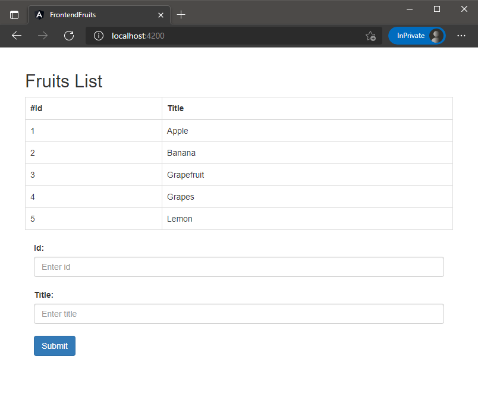

# Creating an Angular App to consume a REST API
## Requirements
1. Node.js/npm
2. Visual Code
3. Express REST API (fruits-rest-api) running on port 3000.

## Installing Angular CLI and creating app
1. Create a new folder for this application and open a new terminal and cd into this folder.
2. Type **`npm i @angular/cli -g`**. (This can take several minutes).
   > In case you are using PowerShell, you need to set a policy `Set-ExecutionPolicy -ExecutionPolicy Unrestricted`
4. Create a new Angular app using the following command: **`ng new frontend-fruits`**. When prompted for Angular routing answer **N**. Then chose **CSS Stylesheet**. (This can take several minutes).
5. Once the installation is done, cd into `frontend-fruits` folder and then start the server using **`ng serve`**. This will compile and build the site.
6. Browse the site with `http://localhost:4200` to get the default page.
7. You can define specific port using **`ng serve --host 0.0.0.0 --port 8080`**.

## Create and configure an Angular HttpClient
1. Type **`code .`** in your terminal to open Visual Code.
2. Add `HttpClient` class to access the REST backend API. Navigate through `src/app/app.module.ts` and open this file and import the class as followed:
    ```javascript
    import { HttpClientModule } from '@angular/common/http';
    ```
3. Add the module `HttpClientModule` in  `@NgModule` imports section.
    ```javascript
        @NgModule({
        declarations: [
            AppComponent
        ],
        imports: [
            BrowserModule,
            HttpClientModule
        ],
        providers: [],
        bootstrap: [AppComponent]
        })
    ```

## Create an Angular Service
1. Type **`ng g service app`** in the terminal. This will create two files under the Angular project `src/app/app.service.spec.ts` and `src/app/app.service.ts`.
2. Then create a class with this command **`ng g cl fruit`**, this will create two files as well `src/app/fruit.spec.ts` and `src/app/fruit.ts`.
3. Remove `src/app/fruit.spec.ts`, we don't need this file for now.

4. Open file `src/app/fruit.ts` and add the following code:
    ```javascript
        export class Fruit {
            
            public id: number;
            public title: string;

            constructor(id: number, title: string) {
                this.id = id;
                this.title = title;
            }
        }

    ```
5. Edit file `src/app/app.service.ts` and import HttpClient class from '@angular/common/http';
    ```javascript
    import { HttpClient } from '@angular/common/http';
    ```
6. Replace the existing constructor passing the HttpClient object:
    ```javascript
    constructor(private http: HttpClient) { }
    ```
7. Declare a variable before the constructor pointing to the REST API endpoint:
    ```javascript
    private API_ENDPOINT='http://localhost:3000';
    ```
8. Import the fruits model in the top with:
    ```javascript
    import { Fruit } from "./fruit";
    ```
9. Use an Observable, this is used frequently in Angular and it is a technique for event handling, asynchronous programming, and handling multiple values, import the module using:
    ```
    import { Observable } from 'rxjs';
    ```
10. Add the following method inside AppService class to implement the Observable:
    ```javascript
     getFruits(): Observable<Fruit> {
         return this.http.get<Fruit>(this.API_ENDPOINT + '/fruits')
        }
    ```
11. The final structure should be like this:
    ```javascript
    import { Injectable } from '@angular/core';
    import { HttpClient } from '@angular/common/http';
    import { Fruit } from "./fruit";
    import { Observable } from 'rxjs';

    @Injectable({
    providedIn: 'root'
    })

    export class AppService {

        private API_ENDPOINT='http://localhost:3000';

        constructor(private http: HttpClient) { }

        getFruits(): Observable<Fruit> {
            return this.http.get<Fruit>(this.API_ENDPOINT + '/fruits')
        }
    
    }

    ```
## Implementing the service into a Component

1. Modify `src/app/app.component.ts` and import the service with:
    ```javascript
    import { AppService } from './app.service';
    ```
2. Add `OnInit` class to the existing '@angular/core' line:
    ```javascript
    import { Component, OnInit } from '@angular/core';
    ```
3. Replace the AppComponent class with the following code:
    ```javascript
    export class AppComponent implements OnInit {

        title = 'frontend-fruits';
        fruits: any = [];

        constructor(private appService: AppService) { }

        ngOnInit() {
            this.getFruits(); 
        }

        getFruits() {
                return this.appService.getFruits().subscribe((data: {}) => {
                    this.fruits = data;
                })    
            } 
    }
   ```
   This code is calling the service on the ngOnInit() method and passing the result into an array object.

4. Modify `src/app/app.component.html` and replace the existing html with the following:
    ```html
    <div class="container">
        <br/>
        <h2>Fruits List</h2>

        <table class="table table-bordered">
            <thead>   
                <tr>
                    <th scope="col">#Id</th>
                    <th scope="col">Title</th>  
                </tr>
            </thead>
            <tbody>
                <tr *ngFor="let fruit of fruits">
                    <td>{{ fruit.id }}</td>
                    <td>{{ fruit.title }}</td>
                </tr>
            </tbody>
        </table>
    </div>
    ```
    Use ngFor to iterate in the array object and access the fields.

5. Save all and browse to `http://localhost:4200` to review the changes.

## Adding new methods to Angular Service
1. To implement a http post, open `src/app/app.service.ts` and import this class:

    ```javascript
    import { HttpHeaders } from '@angular/common/http';
    ```
2. Create a httpOptions object after the imported modules and before Injectable section:

    ```javascript
    const httpOptions = {
        headers: new HttpHeaders({
            'Content-Type':  'application/json'
        })
    };
    ```
3. Then add the following post method:
    ```javascript
    addFruit(fruit: Fruit): Observable<Fruit> {
        return this.http.post<Fruit>(this.API_ENDPOINT + '/fruits', fruit, httpOptions)
    }
    ```
4. Final structure of this file will be like this:

    ```javascript
    import { Injectable } from '@angular/core';
    import { HttpClient } from '@angular/common/http';
    import { Fruit } from "./fruit";
    import { Observable } from 'rxjs';
    import { HttpHeaders } from '@angular/common/http';

    const httpOptions = {
        headers: new HttpHeaders({
            'Content-Type':  'application/json'
        })
    };

    @Injectable({
        providedIn: 'root'
    })

    export class AppService {

        private API_ENDPOINT='http://localhost:3000';

        constructor(private http: HttpClient) { }

        getFruits(): Observable<Fruit> {
            return this.http.get<Fruit>(this.API_ENDPOINT + '/fruits')
        }

        addFruit(fruit: Fruit): Observable<Fruit> {
            return this.http.post<Fruit>(this.API_ENDPOINT + '/fruits', fruit, httpOptions)
        }

    }
    ```
## Implementing Angular Forms
1. Modify `src/app/app.module.ts` and import the following modules in the top:
    ``` javascript
    import { FormsModule, ReactiveFormsModule } from '@angular/forms';
    ```
2. Then add these modules inside @NgModule imports section as followed:
    ```javascript
    @NgModule({
    declarations: [
        AppComponent
    ],
    imports: [
        BrowserModule,
        HttpClientModule,
        FormsModule,
        ReactiveFormsModule
    ],
    providers: [],
    bootstrap: [AppComponent]
    })
    ```
3. Open the file `src/app/app.component.ts` and import `FormGroup` and `FormControl` clases from Angular forms.
    ```javascript
    import { FormGroup, FormControl } from '@angular/forms';
    ```
4. Create a FormGroup to track the value and validity state of a group of FormControl.
    ```javascript
    title = 'frontend-fruits';
    fruits: any = [];

    fruitsForm = new FormGroup({
        id: new FormControl(''),
        title: new FormControl('')
    });
    ```
5. Add the following method to pass the form values to the service on the submit button event.
    ```javascript
    addFruit(){
        this.appService.addFruit(this.fruitsForm.value)
        .subscribe(fruit => {
        this.fruits.push(fruit);
        this.getFruits();
        this.fruitsForm.reset();
        });
    }
    ```
6. Final structure of this document will be like this:
    ```javascript
    import { Component, OnInit } from '@angular/core';
    import { AppService } from './app.service';
    import { FormGroup, FormControl } from '@angular/forms';

    @Component({
    selector: 'app-root',
    templateUrl: './app.component.html',
    styleUrls: ['./app.component.css']
    })

    export class AppComponent implements OnInit {

        title = 'frontend-fruits';
        fruits: any = [];
        fruitsForm = new FormGroup({
            id: new FormControl(''),
            title: new FormControl('')
        });

        constructor(private appService: AppService) { }

        ngOnInit() {
            this.getFruits();
        }

        getFruits() {
            return this.appService.getFruits().subscribe((data: {}) => {
            this.fruits = data;
            })    
        }

        addFruit(){
            this.appService.addFruit(this.fruitsForm.value)
            .subscribe(fruit => {
            this.fruits.push(fruit);
            this.getFruits();
            this.fruitsForm.reset();
            });
        }
    }

    ```
7. Open `src/app/app.component.html` and add the following section at the end of the existing content:
    ```html
        <div class="container">
        <form (ngSubmit)="addFruit()" [formGroup]="fruitsForm">
            <div class="form-group col-md-4">
            <label for="id">Id:</label>
            <input formControlName="id" class="form-control" id="id" placeholder="Enter id"><br/>
            <label for="title">Title:</label>
            <input formControlName="title" class="form-control" id="title" placeholder="Enter title"><br/>
            <button type="submit" class="btn btn-primary">Submit</button>
            </div>
        </form>
        </div>
    ```
    This form pattern is using ReactiveForms https://angular.io/guide/reactive-forms
8. Save all and browse to `http://localhost:4200` to review the changes.

## Implementing CSS 

There are several ways to implement CSS specially for Bootstrap, in this lab will be taking the easy one.
1. Open `src/styles.css` and add this line:
    ```javascript
    @import url('https://unpkg.com/bootstrap@3.3.7/dist/css/bootstrap.min.css');
    ```
2. Save all and browse to `http://localhost:4200` to review the changes.

## Final Result

   
