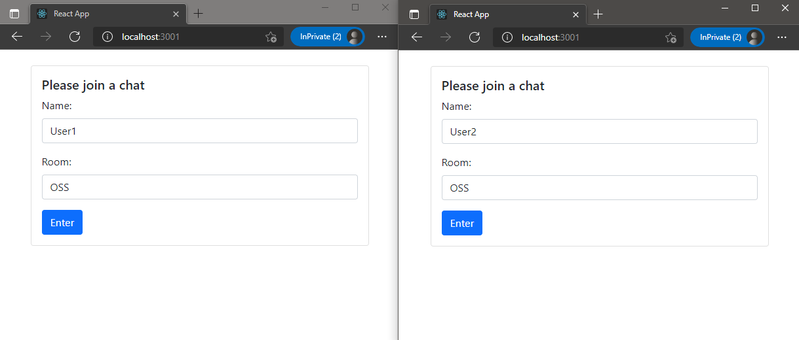
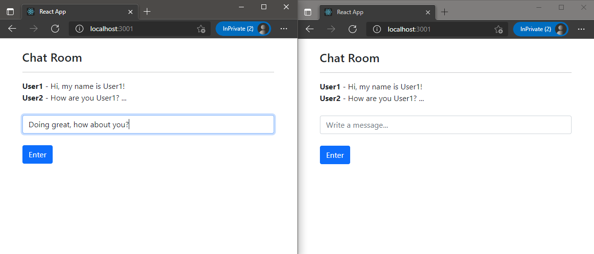
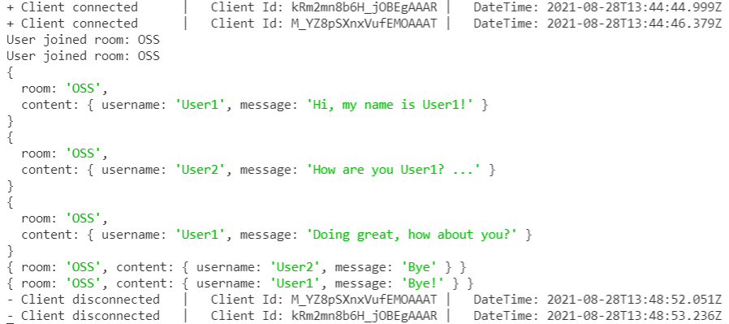

## Requirements
1. [Node.js/npm](https://nodejs.org/en/download/)
2. [Visual Code](https://code.visualstudio.com/download)

## Creating a React App
1. In your terminal create a react app using **`npx create-react-app client`**. (This process might take several mins)
3. Once it is finished, cd into `client` folder.
4. Run the application with **`npm start`**. When prompting to select a different port, please **Y**, since you will be running server on port 3000, react app will pick 3001.
5. Browse the application `http://localhost:3001`

## Creating Socket.io client using React Hooks
1. In your terminal type **`npm install socket.io-client --save`**.
2. Type **`code .`** to open Visual Code on the current directory.
3. Open file `src/App.js` and remove all the content from that file.
4. You will be working on the following structure, copy this structure inside `src/App.js`: 

    ```
    //Import classes section

    //Global const variables

    //Main function
    function App() {
    
        //const variables

        //effects

        //methods

        //Returning HTML section
        return (
            <div> </div>
        );
    }

    export default App;
    ```
5. Start importing react with [hooks](https://reactjs.org/docs/hooks-intro.html) and socket client with the following:
    ```
    import React, { useState, useEffect, useRef } from "react";
    import io from "socket.io-client";
    ```
6. Then create the following global const variables for server: 
    ```
    const SERVER_ENDPOINT = "http://localhost:3000";
    let socket;
    ```
7. Inside function App method add the following code, to create the connection to the socket.io server:
    ```
    useEffect(() => {
        socket = io(SERVER_ENDPOINT);
    }, []);
    ```
    The [Effect Hook](https://reactjs.org/docs/hooks-effect.html) lets you perform side effects in function components.
8. You can implement [useState](https://reactjs.org/docs/hooks-state.html), which is a Hook that lets you add React state to function components. In the const variables section inside App main function add the following const:
    ```
    const [loggedIn, setLoggedIn] = useState(false);
    const [room, setRoom] = useState('');
    const [userName, setUserName] = useState('')
    const [message, setMessage] = useState('');
    const [messageList, setMessageList] = useState([]);
    ```
    These variables will help to manage if the user is logged or not, update room, username, invidual message and a list of messages.

9. Implement the first method to connect to a room and change the state of loggedIn to true.
    ```
        const connectToRoom = () =>{
            setLoggedIn(true);
            socket.emit("join_room", room);
        };
    ```
10. Second method will be for sending the message, passing an object with the room and a content with username and message, then it will emit the message to that specific room and updating the array of messages.
    ```
    const sendMessage = async() =>{

        let messageContent = {
            room: room,
            content:{
                username: userName,
                message: message
            }
        };

        await socket.emit("send_message", messageContent);
        setMessageList([...messageList, messageContent.content])
        setMessage("");
    };
    ```
11. Then you will need to implement another effect to receive messages from the server, which will contain the list of messages from specific room.
    ```
    useEffect(() =>{
        socket.on("receive_message", (data) =>{
        setMessageList([...messageList,data])
        });
    });
    ```

## Implementing React Forms with Bootstrap
1. In your terminal type **`npm install react-bootstrap@next bootstrap@5.1.0 --save`** to include React Bootstrap in your project.
2. In the same file `src/App.js` import Bootstrap files and classes:
```
    import 'bootstrap/dist/css/bootstrap.min.css';
    import {Button, Card, Form, Container} from 'react-bootstrap'
```
3. In the const variables inside function App, create a [reference](https://reactjs.org/docs/hooks-reference.html#useref) object:
```
    const formRef = useRef(null);
```
4. In the return method for HTML, replace the existing content with:

    ```
    return (
        <div>
        <Form  ref={formRef}>
        {
            !loggedIn ?(
            <Container>
                <br/>
                <Card>
                <Card.Body>
                    <Card.Title>Please join a chat</Card.Title>
                    <Card.Text>
                    <Form.Group className="mb-3" controlId="name">
                        <Form.Label>Name:</Form.Label>
                        <Form.Control type="text" onChange={(e)=>{setUserName(e.target.value)}} placeholder="Write a name..." />
                    </Form.Group>
                    <Form.Group className="mb-3" controlId="room">
                        <Form.Label>Room:</Form.Label>
                        <Form.Control type="text" onChange={(e)=>{setRoom(e.target.value)}} placeholder="Write a room..." />
                    </Form.Group>
                    </Card.Text>
                    <Button onClick={connectToRoom} variant="primary">Enter</Button>
                </Card.Body>
                </Card>
            </Container>
            ):(
            <Container>
                <br/>
                <h3>Chat Room</h3>
                <hr/>
                { messageList.map((key, val) =>{
                    return(
                        <div>
                        <b>{key.username}</b> - {key.message}
                        </div>
                    );
                })}
                <br/>
                <Form.Group className="mb-3" controlId="message">
                    <Form.Control type="text" onChange={(e)=>{setMessage(e.target.value)}} placeholder="Write a message..." /> <br/>
                    <Button onClick={sendMessage} variant="primary">Enter</Button>
                </Form.Group>
            </Container>
            )
        }
        </Form>
        </div>
    );
    ```
    In this form, it will be validating if the user is logged or not with this condition  `!loggedIn ?(notlogged):(logged)`. In the first container, it is printing a form for setting a `UserName` and `Room` and then click to call `connectToRoom` and join that room. After logged, it will show the next container where the user can submit a message to that room. If another user connects to the same room, then they can start chatting and sharing the same list of messages.
5. Add a method to reset the form after submiting the message inside `sendMessage` method.
    ```
    const sendMessage = async() =>{
        //....
        //setMessage("");

        formRef.current.reset();
    };
    ```

## Final Structure
-  Review the final code structure:
    ```
    import React, { useState, useEffect, useRef } from "react";
    import 'bootstrap/dist/css/bootstrap.min.css';
    import {Button, Card, Form, Container} from 'react-bootstrap'

    import io from "socket.io-client";
    const SERVER_ENDPOINT = "http://localhost:3000";
    let socket;

    function App() {
    const [loggedIn, setLoggedIn] = useState(false);
    const [room, setRoom] = useState('');
    const [userName, setUserName] = useState('')
    const [message, setMessage] = useState('');
    const [messageList, setMessageList] = useState([]);
    const formRef = useRef(null);

    useEffect(() => {
        socket = io(SERVER_ENDPOINT);
    }, []);

    useEffect(() =>{
        socket.on("receive_message", (data) =>{
        setMessageList([...messageList,data])
        });
    });

    const connectToRoom = () =>{
        setLoggedIn(true);
        socket.emit("join_room", room);
    };

    const sendMessage = async() =>{

        let messageContent = {
        room: room,
        content:{
            username: userName,
            message: message
        }
        };

        await socket.emit("send_message", messageContent);
        setMessageList([...messageList, messageContent.content])
        setMessage("");

        formRef.current.reset();
    };

    return (
        <div>
        <Form  ref={formRef}>
        {
            !loggedIn ?(
            <Container>
                <br/>
                <Card>
                <Card.Body>
                    <Card.Title>Please join a chat</Card.Title>
                    <Card.Text>
                    <Form.Group className="mb-3" controlId="name">
                        <Form.Label>Name:</Form.Label>
                        <Form.Control type="text" onChange={(e)=>{setUserName(e.target.value)}} placeholder="Write a name..." />
                    </Form.Group>
                    <Form.Group className="mb-3" controlId="room">
                        <Form.Label>Room:</Form.Label>
                        <Form.Control type="text" onChange={(e)=>{setRoom(e.target.value)}} placeholder="Write a room..." />
                    </Form.Group>
                    </Card.Text>
                    <Button onClick={connectToRoom} variant="primary">Enter</Button>
                </Card.Body>
                </Card>
            </Container>
            ):(
            <Container>
                <br/>
                <h3>Chat Room</h3>
                <hr/>
                { messageList.map((key, val) =>{
                    return(
                        <div>
                        <b>{key.username}</b> - {key.message}
                        </div>
                    );
                })}
                <br/>
                <Form.Group className="mb-3" controlId="message">
                    <Form.Control type="text" onChange={(e)=>{setMessage(e.target.value)}} placeholder="Write a message..." /> <br/>
                    <Button onClick={sendMessage} variant="primary">Enter</Button>
                </Form.Group>
            </Container>
            )
        }
        </Form>
        </div>
    );
    }

    export default App;
    ```
## Runing Chat app
1. Review if the app is currently working from previous execution, if yes just browse to `http://localhost:3001`, if not then type **`npm start`**.
2. Review if the server is running on port `3000`.
3. Open two or more browser tabs, join with different users to a same room.

    

4. Start chatting between those users.

    

5. Review the server side logging. 

   